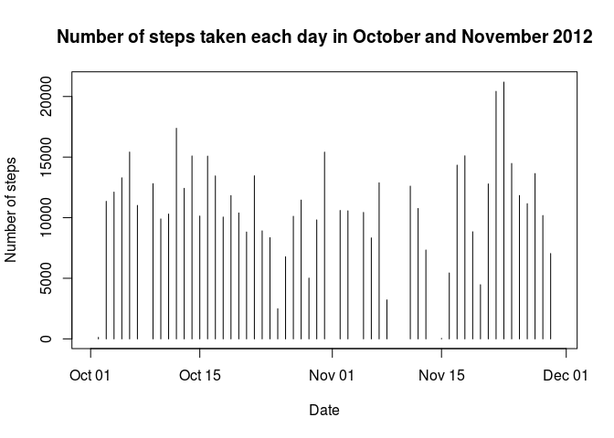
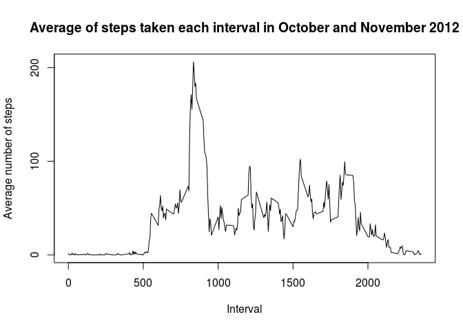
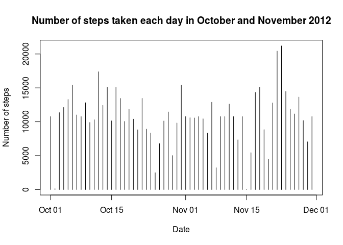
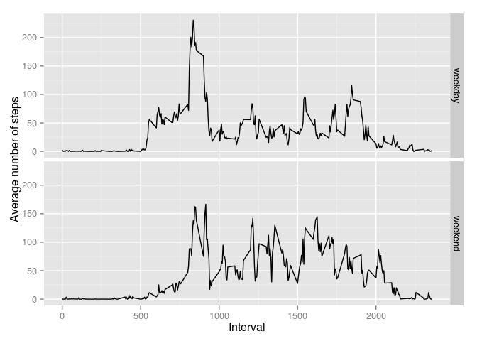

# Reproducible Research: Peer Assessment 1


## Loading and preprocessing the data

Unzipping, loading and checking the structure of the data:


```r
unzip("activity.zip")
activity <- read.csv("activity.csv")
library(data.table)
activity <- data.table(activity)
str(activity)
```

```
## Classes 'data.table' and 'data.frame':	17568 obs. of  3 variables:
##  $ steps   : int  NA NA NA NA NA NA NA NA NA NA ...
##  $ date    : Factor w/ 61 levels "2012-10-01","2012-10-02",..: 1 1 1 1 1 1 1 1 1 1 ...
##  $ interval: int  0 5 10 15 20 25 30 35 40 45 ...
##  - attr(*, ".internal.selfref")=<externalptr>
```

Putting the date in POSIX format


```r
library(dplyr)
```

```
## 
## Attaching package: 'dplyr'
## 
## The following objects are masked from 'package:data.table':
## 
##     between, last
## 
## The following objects are masked from 'package:stats':
## 
##     filter, lag
## 
## The following objects are masked from 'package:base':
## 
##     intersect, setdiff, setequal, union
```

```r
activity <- mutate(activity, date = as.POSIXct(date, "%Y-%m-%d"))
```


## What is mean total number of steps taken per day?

Total number of steps taken per day
Note: When going through this again I thought it may be better to use "na.rm = TRUE" for the sum() (inside of tapply). But this creates values of 0, which then decreases the mean and median unfairly. For this final version na's are not removed until the mean and median are calculated.


```r
daysteps <- tapply(activity$steps, activity$date, sum, simplify = TRUE)
daysteps <- as.data.frame(daysteps)
daysteps <- cbind(date = rownames(daysteps), daysteps)
daysteps$date <- as.Date(daysteps$date)
head(daysteps)                  #Here is an example of how the dataset looks like
```

```
##                  date daysteps
## 2012-10-01 2012-10-01       NA
## 2012-10-02 2012-10-02      126
## 2012-10-03 2012-10-03    11352
## 2012-10-04 2012-10-04    12116
## 2012-10-05 2012-10-05    13294
## 2012-10-06 2012-10-06    15420
```

The histogram


```r
plot(daysteps$date, daysteps$daysteps, type = "h", main = "Number of steps taken each day in October and November 2012", xlab = "Date", ylab = "Number of steps")
```

 

The mean and median

mean: 10766.19

median: 10765


```r
mean(daysteps$daysteps, na.rm = TRUE)
```

```
## [1] 10766.19
```

```r
median(daysteps$daysteps, na.rm = TRUE)
```

```
## [1] 10765
```

## What is the average daily activity pattern?

I use tapply to record the mean amount of steps for each interval (from all the days). After creating "pattern" the interval is in the rownames of of "pattern".


```r
pattern <- tapply(activity$steps, activity$interval, mean, na.rm = TRUE, simplify = TRUE)
plot(rownames(pattern), pattern, type = "l", main = "Average of steps taken each interval in October and November 2012", xlab = "Interval", ylab = "Average number of steps", yaxp = c(0, 2400, 24))
```

 

This 5-minute interval contains the most number of steps on average (also includes that number)

Interval:                 835 (so, 08:35 AM)

Average number of steps:  206.17


```r
max.interval <- pattern[pattern == max(pattern)]
max.interval
```

```
##      835 
## 206.1698
```

## Imputing missing values

The number of missing values, using sum() and is.na()

2304 missing values (out of 17568)


```r
sum(is.na(activity$steps))
```

```
## [1] 2304
```

(Filling in missing values is very odd, but alright.) I choose to use the mean value of the interval. It looks like usually when there are NA values, it is for a whole day, so if we took the average of the day it probably would just be 0 for those days and it is likely that he did actually walk.


```r
intervalmeans <- tapply(activity$steps, activity$interval, mean, na.rm = TRUE)          #This creates a vector in which the mean for each interval is stored
activity2 <- activity
for (i in 1:17568) {
    if (is.na(activity2$steps[i]) == TRUE) {                                            #Check if the value is NA
          activity2$steps[i] <- intervalmeans[as.character(activity2$interval[i])]      #Set that value to the average of that interval
    }
}
```

Histogram:


```r
daysteps2 <- tapply(activity2$steps, activity2$date, sum, simplify = TRUE)        #These are the same steps as in question 2
daysteps2 <- as.data.frame(daysteps2)
daysteps2 <- cbind(date = rownames(daysteps2), daysteps2)
daysteps2$date <- as.Date(daysteps2$date)
plot(daysteps2$date, daysteps2$daysteps2, type = "h", main = "Number of steps taken each day in October and November 2012", xlab = "Date", ylab = "Number of steps")
```

 

```r
head(daysteps2)
```

```
##                  date daysteps2
## 2012-10-01 2012-10-01  10766.19
## 2012-10-02 2012-10-02    126.00
## 2012-10-03 2012-10-03  11352.00
## 2012-10-04 2012-10-04  12116.00
## 2012-10-05 2012-10-05  13294.00
## 2012-10-06 2012-10-06  15420.00
```

Mean and median:

Mean:     10766.19

Median:   10766.19

The mean is still the same, which is logical because generally whole days have been missing, and those days are simply the average daily steps taken because of the method I used. The median is now equal to the mean and the reason for is is quite simple. The days that only had NA values, now have a value that is equal to the mean. Since mean values will generally sit in the middle of the data, the median now finds this number.


```r
mean(daysteps2$daysteps2, na.rm = TRUE)
```

```
## [1] 10766.19
```

```r
median(daysteps2$daysteps2, na.rm = TRUE)
```

```
## [1] 10766.19
```

## Are there differences in activity patterns between weekdays and weekends?

I use dplyr's "mutate" to add a new function. See "?ifelse"" for more details on what happens. Simply stated, it checks if the weekday of the date is in the weekend. If yes, it names it 'weekend', if no, it names it 'weekday'.


```r
weekend <- c("Saturday", "Sunday")
library(dplyr)
activity2 <- mutate(activity2, 
                    weekday = ifelse(weekdays(date) %in% weekend, "weekend", "weekday")
)
```

Here I use dplyr's "summarize" to only have the mean values of steps for each interval and weekday.

In the plot you can see that on weekdays, the walking is generally done early in the morning, and there is a smaller peak around 18:00. On weekends he walks less and the walking is more spead over the whole day.


```r
plotdata <- summarize(group_by(activity2, interval, weekday), mean.steps = mean(steps))
library(ggplot2)
ggplot(plotdata, aes(interval, mean.steps)) + geom_line() + facet_grid(weekday ~ .) + labs(x = "Interval", y = "Average number of steps")
```

 
